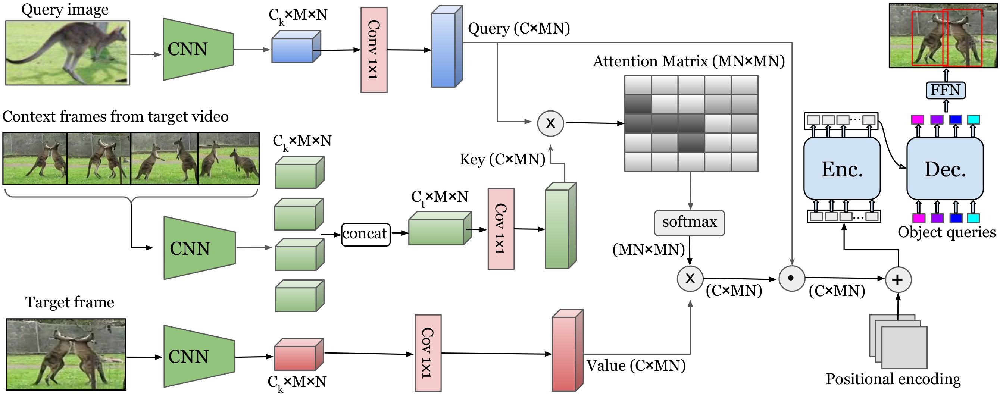

# QDETRv: Query-Guided DETR for One-Shot Object Localization in Videos

[](https://anandmishra22.github.io/files/Kumar-AAAI24.pdf)

## Overview
<p align="center">
    
</p>

> **QDETRv: Query-Guided DETR for One-Shot Object Localization in Videos**<br>
> [Yogesh Kumar](https://yogesh-iitj.github.io/), 
[Saswat Mallick](https://scholar.google.com/citations?hl=en&user=Sq9hlQQAAAAJ), 
[Anand Mishra](https://anandmishra22.github.io/), 
[Sowmya Rasipuram](https://scholar.google.co.in/citations?user=c0nyUPcAAAAJ&hl=en),
[Anutosh Maitra](https://dblp.org/pid/78/424.html), 
[Roshni Ramnani](https://scholar.google.com/citations?user=DThywGgAAAAJ&hl=en) <br>
> **AAAI 2024**

This repo contains the code for training QDETRv, which implements an efficient approach for one-shot object localization in videos, extending the Query-Guided DETR (QDETR) framework to handle spatiotemporal consistency across video frames. By leveraging query-based attention mechanisms, QDETRv enables robust localization of objects in unseen video sequences based on a single reference image, achieving high accuracy with minimal supervision. 

## To setup environment
```
# create new env fsrr
$ conda create -n qdetr python=3.10.4

# activate qdetr
$ conda activate qdetr

# install pytorch, torchvision
$ conda install -c pytorch pytorch torchvision
$ conda install cython scipy

# install other dependencies
$ pip install -r requirements.txt
```

## Pre-training
```
# download IMGENET and UCF-101 dataset
# To create the synthetic data for pre-training:
$ python ./dataset/syn_trajectory.py path/to/video_folder path/to/output_csv_annotations path/to/save/process_videos

# To pre-train the model
# set config_pre.py

# set CUDA devices
$ export CUDA_VISIBLE_DEVICES=0,1

# Image-level pretraining
$ python train_qdetr_pre.py

# video-level pertaining
$ python train_qdetrv_pre.py
```
## Training 
```
# To download the images
$ python ./dataset/1_download_images.py

# To filter queries into main categories
$ python ./dataset/2_filter_queries.py

# To create query images and target video pairs for training and testing
$ python ./dataset/3_generate_pairs.py

# To train the model

# set config.py
# set CUDA devices
$ export CUDA_VISIBLE_DEVICES=0,1

# training image-level QDETR
$ python train_qdetr.py

# training video-level QDETR
$ python train_qdetrv.py
```
## Evaluation
```
# set the paths in config
$ python eval.py 
```

## Citation
If you find this repo useful, please cite:
```
@inproceedings{kumar2024qdetrv,
  title={QDETRv: Query-Guided DETR for One-Shot Object Localization in Videos},
  author={Kumar, Yogesh and Mallick, Saswat and Mishra, Anand and Rasipuram, Sowmya and Maitra, Anutosh and Ramnani, Roshni},
  booktitle={Proceedings of the AAAI Conference on Artificial Intelligence},
  volume={38},
  number={3},
  pages={2831--2839},
  year={2024}
}
```